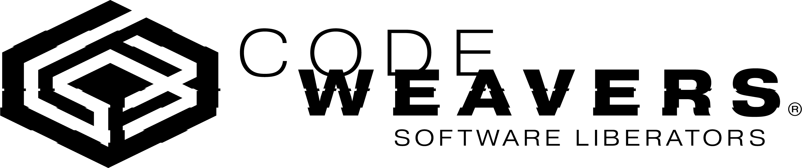

# Whisky 🥃
*比 Wine 更强大一点*

与 macOS 无缝集成的熟悉界面

  

  一键创建和管理 Bottle

轻松调试和性能分析

---

Whisky 为 Wine 提供了一个干净易用的图形化封装，采用原生 SwiftUI 构建。你可以创建和管理 Bottle，安装并运行 Windows 应用和游戏，无需任何技术知识即可释放 Mac 的全部潜力。Whisky 基于 CrossOver 22.1.1 以及 Apple 自家的 `Game Porting Toolkit` 构建。

在 [Crowdin](https://crowdin.com/project/whisky) 上进行翻译。

---

## 系统要求
- CPU：Apple Silicon（M 系列芯片）
- 操作系统：macOS Sonoma 14.0 或更高版本

## 我的游戏无法运行！

部分游戏需要特殊步骤才能运行。请查阅 [wiki](https://github.com/IsaacMarovitz/Whisky/wiki/Game-Support)。

---

## 致谢

得益于以下多个项目，Whisky 才得以实现：

- [msync](https://github.com/marzent/wine-msync) — marzent
- [DXVK-macOS](https://github.com/Gcenx/DXVK-macOS) — Gcenx 和 doitsujin
- [MoltenVK](https://github.com/KhronosGroup/MoltenVK) — KhronosGroup
- [Sparkle](https://github.com/sparkle-project/Sparkle) — sparkle-project
- [SemanticVersion](https://github.com/SwiftPackageIndex/SemanticVersion) — SwiftPackageIndex
- [swift-argument-parser](https://github.com/apple/swift-argument-parser) — Apple
- [SwiftTextTable](https://github.com/scottrhoyt/SwiftyTextTable) — scottrhoyt
- [CrossOver 22.1.1](https://www.codeweavers.com/crossover) — CodeWeavers 和 WineHQ
- D3DMetal — Apple

特别感谢 Gcenx、ohaiibuzzle 和 Nat Brown 的支持与贡献！

---

<table>
  <tr>
    <td>
        <picture>
          <source media="(prefers-color-scheme: dark)" srcset="./images/cw-dark.png">
          
        </picture>
    </td>
    <td>
        如果没有 CrossOver，Whisky 就不可能存在。请通过我们的<a href="https://www.codeweavers.com/store?ad=1010">推介链接</a>支持 CodeWeavers 的工作。
    </td>
  </tr>
</table>

---

# Whisky 🥃
*Wine but a bit stronger*

Familiar UI that integrates seamlessly with macOS

  

  One-click bottle creation and management

Debug and profile with ease

---

Whisky provides a clean and easy to use graphical wrapper for Wine built in native SwiftUI. You can make and manage bottles, install and run Windows apps and games, and unlock the full potential of your Mac with no technical knowledge required. Whisky is built on top of CrossOver 22.1.1, and Apple's own `Game Porting Toolkit`.

Translated on [Crowdin](https://crowdin.com/project/whisky).

---

## System Requirements
- CPU: Apple Silicon (M-series chips)
- OS: macOS Sonoma 14.0 or later

## My game isn't working!

Some games need special steps to get working. Check out the [wiki](https://github.com/IsaacMarovitz/Whisky/wiki/Game-Support).

---

## Credits & Acknowledgments

Whisky is possible thanks to the magic of several projects:

- [msync](https://github.com/marzent/wine-msync) by marzent
- [DXVK-macOS](https://github.com/Gcenx/DXVK-macOS) by Gcenx and doitsujin
- [MoltenVK](https://github.com/KhronosGroup/MoltenVK) by KhronosGroup
- [Sparkle](https://github.com/sparkle-project/Sparkle) by sparkle-project
- [SemanticVersion](https://github.com/SwiftPackageIndex/SemanticVersion) by SwiftPackageIndex
- [swift-argument-parser](https://github.com/apple/swift-argument-parser) by Apple
- [SwiftTextTable](https://github.com/scottrhoyt/SwiftyTextTable) by scottrhoyt
- [CrossOver 22.1.1](https://www.codeweavers.com/crossover) by CodeWeavers and WineHQ
- D3DMetal by Apple

Special thanks to Gcenx, ohaiibuzzle, and Nat Brown for their support and contributions!

---

<table>
  <tr>
    <td>
        <picture>
          <source media="(prefers-color-scheme: dark)" srcset="./images/cw-dark.png">
          
        </picture>
    </td>
    <td>
        Whisky doesn't exist without CrossOver. Support the work of CodeWeavers using our <a href="https://www.codeweavers.com/store?ad=1010">affiliate link</a>.
    </td>
  </tr>
</table>
